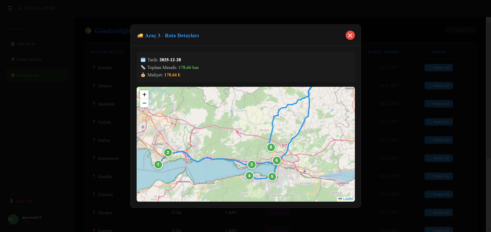
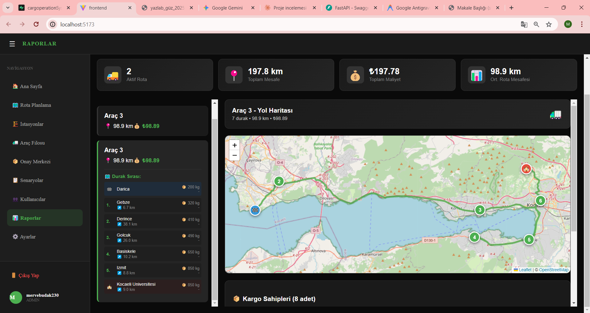
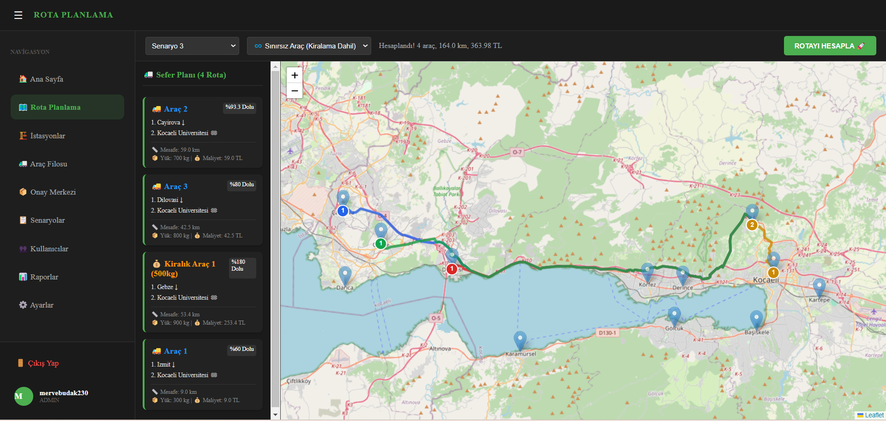
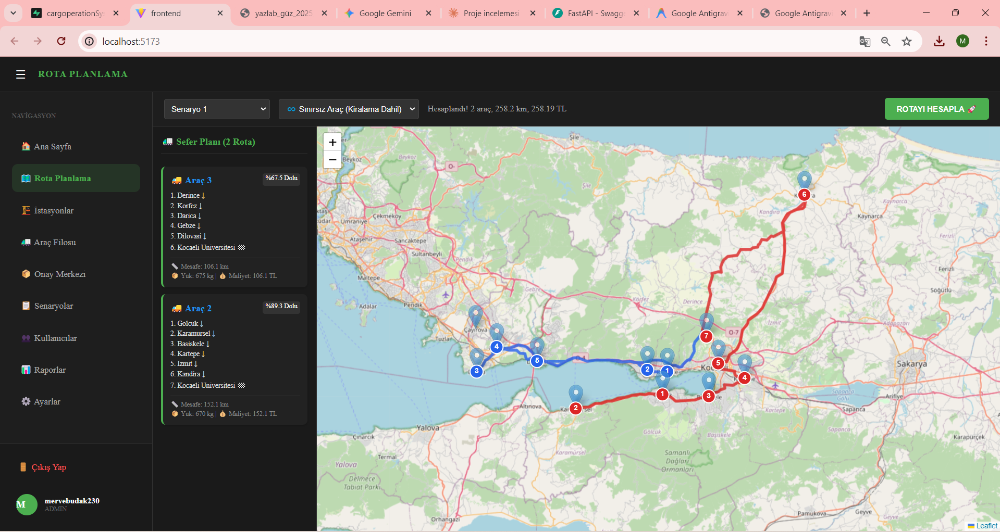

# 🚚 Cargo Operations System

A full-stack **Cargo Operations Management System** built to dynamically optimize logistics networks across Kocaeli province. The system manages cargo delivery from 12 districts to the central Umuttepe campus, routing decisions are based on vehicle capacities and real road distances — not straight-line estimates.

Route optimization is powered by the **Clark-Wright Savings Algorithm** combined with the **Nearest Neighbor heuristic**, avoiding brute-force approaches entirely.



---

## ✨ Features

- **Intelligent Route Optimization** — Clark-Wright algorithm clusters stops; Nearest Neighbor algorithm determines in-vehicle visit order to minimize total distance
- **Real Road Network Integration** — OSMnx + NetworkX build an actual graph of Kocaeli roads; Dijkstra finds shortest real-world paths
- **Fleet & Cost Management** — Owned vehicles (500kg, 750kg, 1000kg) are prioritized; rental vehicles (200 unit cost) are dispatched only when capacity overflows. Fuel: 1 unit/km
- **Live Cargo Tracking** — Users track each shipment status (*Pending → Planned → In Transit*) on the map in real time
- **Scenario-Based Simulation** — Create and run different cargo density scenarios to compare algorithm performance
- **Role-Based Access Control** — Separate Admin and User dashboards secured with Supabase Row Level Security (RLS)

---

## 🛠 Tech Stack

| Layer | Technology |
|---|---|
| Frontend | React.js + React-Leaflet |
| Backend | FastAPI (Python) |
| Database | Supabase (PostgreSQL, 3NF) |
| Routing | OSMnx, NetworkX, Dijkstra |
| Algorithm | Clark-Wright Savings + Nearest Neighbor |

---

## 🚀 Getting Started

### Requirements
- Python 3.9+
- Node.js 16+
- Supabase project (for DB + Auth)

### Backend

```bash
cd backend
python -m venv .venv

# Windows
.venv\Scripts\activate      
# macOS/Linux
# source .venv/bin/activate  

pip install -r requirements.txt
```

Create `backend/.env`:
```env
SUPABASE_URL=your_supabase_url
SUPABASE_KEY=your_supabase_anon_key
```

```bash
uvicorn main:app --reload
```

### Frontend

```bash
cd frontend
npm install
```

Create `frontend/.env`:
```env
VITE_SUPABASE_URL=your_supabase_url
VITE_SUPABASE_ANON_KEY=your_supabase_anon_key
```

```bash
npm run dev
```

---

## 📸 Screenshots

### Admin Dashboard — Fleet & Scenario Overview


### Route Planning — Map Visualization
Optimized routes per vehicle displayed on the interactive map (Vehicle 1, Vehicle 2, etc.).


### User Panel — Cargo Submission & Tracking
Users select origin station, enter weight/quantity, and monitor their shipment live.


---

## 📐 Database Design

Schema is normalized to **3rd Normal Form (3NF)**. Key tables:

| Table | Description |
|---|---|
| `istasyonlar` | 12 district stations with coordinates |
| `istasyon_mesafeleri` | Real road distances (km) + route polylines |
| `araclar` | Fleet vehicles with capacity, cost, and home station |
| `kargolar` | Cargo requests with weight, quantity, and status |
| `rota_ozetleri` | Per-vehicle route summary (total km, cost, stops) |
| `rota_detaylari` | Step-by-step stop sequence with capacity tracking |
| `senaryolar` | Named cargo density scenarios for simulation |
| `sistem_ayarlari` | Dynamic parameters (fuel rate, rental cost) |

---

## 🔬 Algorithm Overview

**Clark-Wright Savings** calculates a *savings value* for merging two stops into one route:

```
S(i,j) = d(depot,i) + d(depot,j) - d(i,j)
```

Stops are merged in descending savings order while respecting vehicle capacity constraints. After clustering, **Nearest Neighbor** orders the stops within each vehicle's route by always choosing the closest unvisited station next.

---
Kocaeli University — Computer Engineering Dept.  
*Programming Laboratory I — Project III*